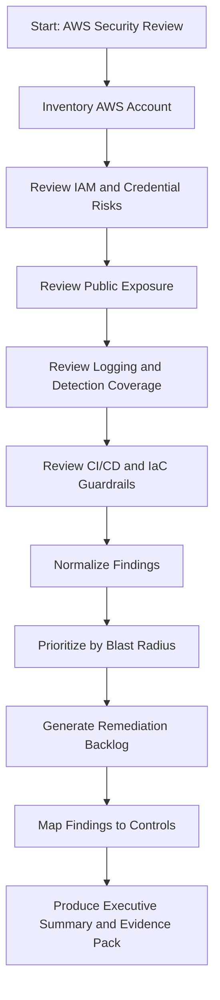

# Architecture

## Overview

This lab uses a documentation-first architecture:

1. Define the security review workflow.
2. Map risks to controls.
3. Implement guardrails with Terraform.
4. Add CI/CD checks.
5. Run lightweight assessment scripts.
6. Normalize findings.
7. Generate a remediation backlog and evidence pack.

## High-Level Workflow

## Logical Components

| Component | Purpose |
|---|---|
| Terraform guardrails | Define repeatable AWS security baselines |
| GitHub Actions workflows | Prevent insecure code and IaC from reaching deployment |
| Python assessment scripts | Detect common AWS security risks |
| Sample findings | Demonstrate expected output format |
| Remediation backlog | Convert findings into owner-ready work |
| Evidence checklist | Support audit, customer review, and control validation |

## Trust Boundaries

| Boundary | Risk |
|---|---|
| Developer workstation to GitHub | Secrets may be committed |
| GitHub Actions to AWS | CI/CD tokens may be over-privileged |
| AWS IAM to AWS resources | Excessive permissions increase blast radius |
| Public internet to AWS services | Public exposure may lead to data leakage or abuse |
| Security findings to engineering backlog | Findings may be ignored without ownership and SLA tracking |

## Control Philosophy

The lab favors:

- least privilege
- secure defaults
- evidence-producing workflows
- human review before destructive remediation
- repeatable infrastructure as code
- CI/CD enforcement before deployment
